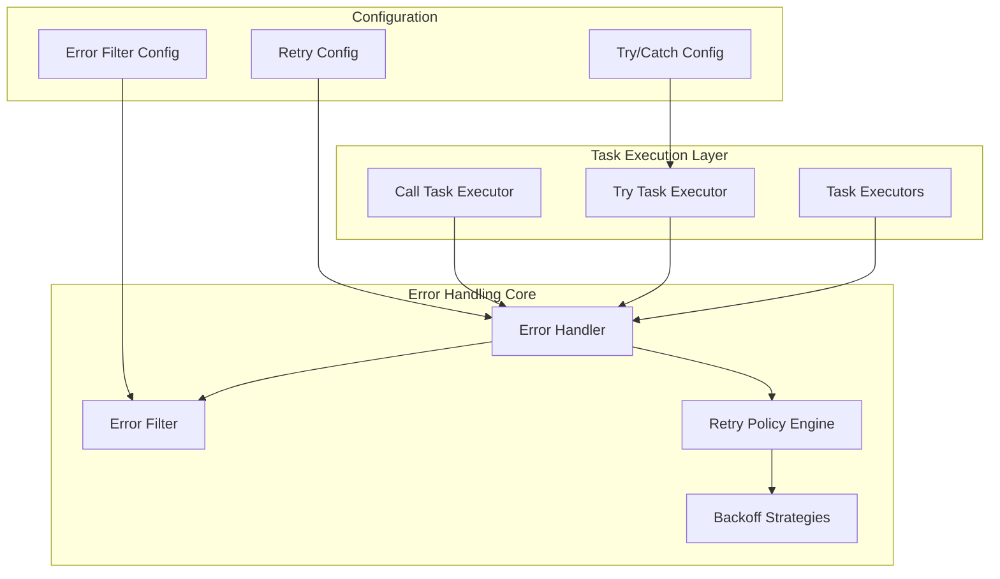

# SDL Error Handling System Design for flunq.io

## Overview

This document outlines the comprehensive design for implementing Serverless Workflow DSL (SDL) compliant error handling and retry policies in the flunq.io executor. The system provides declarative error handling with try/catch blocks, sophisticated retry policies, and error filtering capabilities.

## Architecture

### System Components



### Key Features

1. **SDL Compliance**: Full implementation of SDL try/catch and retry specifications
2. **Declarative Configuration**: YAML/JSON configuration for error handling policies
3. **Multiple Backoff Strategies**: Constant, linear, and exponential backoff with jitter
4. **Error Filtering**: Pattern matching for error types, status codes, and custom properties
5. **Conditional Logic**: Runtime expressions for when/exceptWhen conditions
6. **Recovery Tasks**: Execute specific tasks when errors are caught
7. **Structured Errors**: RFC 7807 Problem Details compliant error format

## Core Data Structures

### TryTaskConfig
```go
type TryTaskConfig struct {
    Try   map[string]*TaskRequest `json:"try" yaml:"try"`
    Catch *CatchConfig            `json:"catch" yaml:"catch"`
}
```

### CatchConfig
```go
type CatchConfig struct {
    Errors     *ErrorFilter            `json:"errors,omitempty"`
    As         string                  `json:"as,omitempty"`
    When       string                  `json:"when,omitempty"`
    ExceptWhen string                  `json:"exceptWhen,omitempty"`
    Retry      *RetryPolicy            `json:"retry,omitempty"`
    Do         map[string]*TaskRequest `json:"do,omitempty"`
}
```

### RetryPolicy
```go
type RetryPolicy struct {
    When       string           `json:"when,omitempty"`
    ExceptWhen string           `json:"exceptWhen,omitempty"`
    Limit      *RetryLimit      `json:"limit,omitempty"`
    Backoff    *BackoffStrategy `json:"backoff,omitempty"`
    Jitter     *JitterConfig    `json:"jitter,omitempty"`
    Delay      *Duration        `json:"delay,omitempty"`
}
```

## Implementation Components

### 1. Error Handler Interface
```go
type ErrorHandler interface {
    HandleError(ctx context.Context, err error, config *CatchConfig, errorCtx *ErrorContext) (*ErrorHandlingResult, error)
    ShouldRetry(ctx context.Context, err error, policy *RetryPolicy, errorCtx *ErrorContext) (bool, time.Duration, error)
    MatchesFilter(err error, filter *ErrorFilter) bool
}
```

### 2. Try Task Executor
- Executes try blocks with error handling
- Manages retry loops with backoff strategies
- Executes recovery tasks on error catch
- Integrates with existing task executor framework

### 3. Error Filter System
- Pattern matching for error properties
- Support for regex matching
- Standard SDL error type recognition
- Custom error property filtering

### 4. Retry Policy Engine
- Multiple backoff strategies (constant, linear, exponential)
- Jitter support for avoiding thundering herd
- Attempt and duration limits
- Conditional retry logic with runtime expressions

## Usage Examples

### Basic Try/Catch
```yaml
try:
  - callExternalAPI:
      call: http
      with:
        method: get
        endpoint: https://api.example.com/data
catch:
  errors:
    with:
      type: https://serverlessworkflow.io/spec/1.0.0/errors/communication
      status: 503
  retry:
    delay:
      seconds: 3
    backoff:
      exponential:
        multiplier: 2.0
        maxDelay:
          seconds: 30
    limit:
      attempt:
        count: 5
```

### Error Recovery with Tasks
```yaml
try:
  - processPayment:
      call: http
      with:
        method: post
        endpoint: https://payment.service.com/charge
catch:
  errors:
    with:
      status: 402
  as: paymentError
  do:
    - notifyUser:
        call: http
        with:
          method: post
          endpoint: https://notification.service.com/send
          body:
            message: "Payment failed: ${.paymentError.detail}"
```

### Conditional Retry
```yaml
try:
  - uploadFile:
      call: http
      with:
        method: post
        endpoint: https://storage.service.com/upload
catch:
  retry:
    when: ".error.status >= 500"
    exceptWhen: ".error.status == 507"  # Insufficient storage
    limit:
      attempt:
        count: 3
      duration:
        minutes: 5
```

## Integration Points

### 1. Task Processor Updates
- Remove hardcoded retry logic from task processor
- Integrate TryTaskExecutor into executor registry
- Update task routing to handle try tasks

### 2. Existing Task Executors
- Enhance error reporting with structured WorkflowError
- Add error context propagation
- Maintain backward compatibility

### 3. Configuration System
- Support for retry policy definitions in workflow configuration
- Validation of error handling configurations
- Default retry policies for different task types

## Migration Strategy

### Phase 1: Core Implementation
1. ✅ Define error handling data structures
2. ✅ Implement error handler with filtering
3. ✅ Create try task executor
4. ✅ Implement retry policy engine

### Phase 2: Integration
1. ✅ Update task processor to use new error handling
2. ✅ Register try task executor
3. ✅ Update existing executors to use WorkflowError
4. ✅ Add configuration validation

### Phase 3: Enhancement
1. ✅ Implement runtime expression evaluation
2. ⏳ Add metrics and monitoring
3. ✅ Performance optimization
4. ✅ Comprehensive testing

### Phase 4: Documentation & Testing
1. ✅ API documentation
2. ✅ Usage examples
3. ✅ Integration tests
4. ⏳ Performance benchmarks

## Benefits

### For Workflow Authors
- **Declarative Error Handling**: Define error handling policies in workflow configuration
- **Flexible Retry Strategies**: Multiple backoff options with jitter support
- **Error Recovery**: Execute specific tasks when errors occur
- **Conditional Logic**: Use runtime expressions for complex error handling scenarios

### For System Operators
- **Improved Reliability**: Sophisticated retry mechanisms reduce transient failures
- **Better Observability**: Structured error reporting with detailed context
- **Configurable Policies**: Tune retry behavior without code changes
- **Standard Compliance**: SDL-compliant error handling ensures portability

### For Developers
- **Clean Architecture**: Separation of concerns between execution and error handling
- **Extensible Design**: Easy to add new backoff strategies or error filters
- **Type Safety**: Strong typing for all error handling configurations
- **Testing Support**: Mockable interfaces for comprehensive testing

## Future Enhancements

1. **Circuit Breaker Pattern**: Automatic failure detection and recovery
2. **Bulkhead Pattern**: Isolate failures to prevent cascade effects
3. **Metrics Integration**: Detailed retry and error metrics
4. **Dynamic Configuration**: Runtime updates to retry policies
5. **Machine Learning**: Adaptive retry strategies based on historical data

## Conclusion

This SDL error handling system provides a comprehensive, standards-compliant solution for error handling and retry logic in flunq.io. The design prioritizes flexibility, reliability, and ease of use while maintaining backward compatibility with existing workflows.